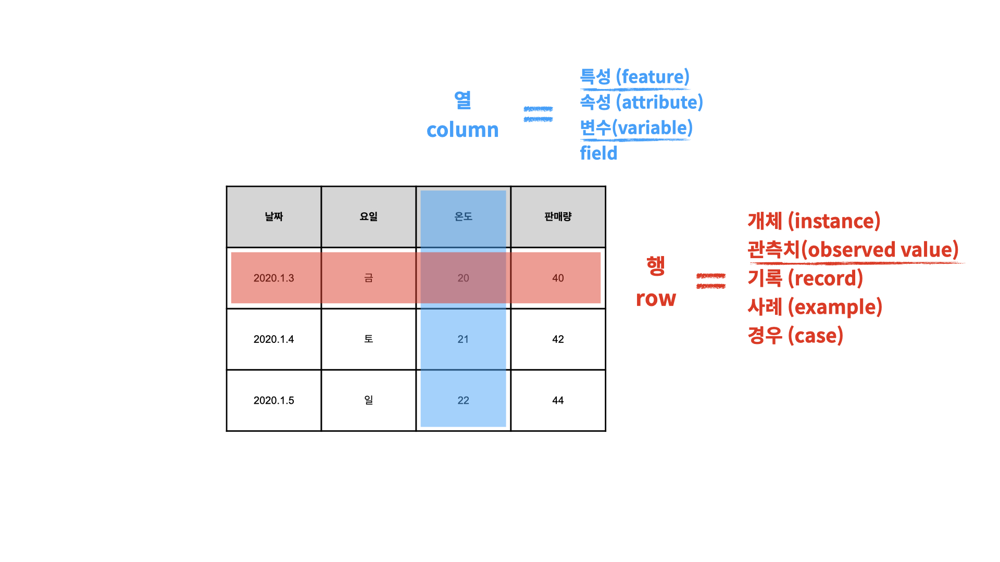
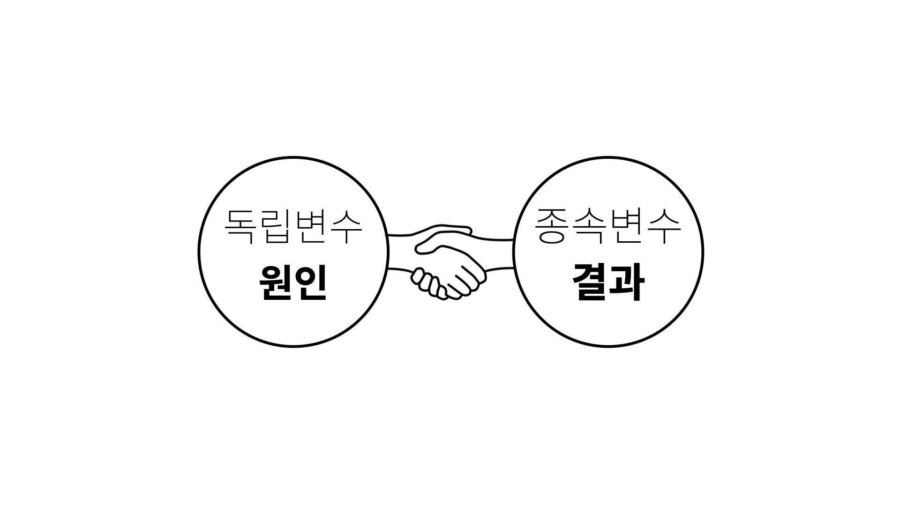
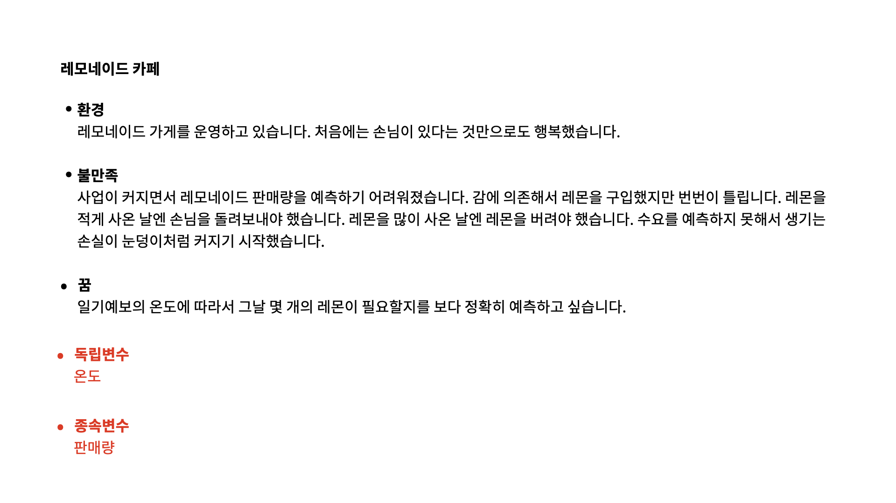
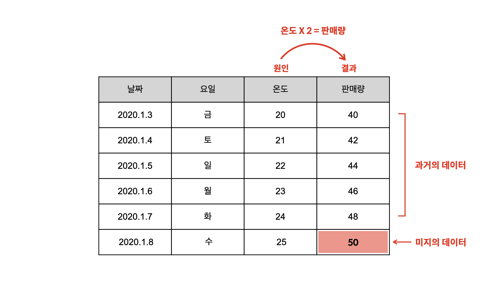

### 데이터 산업에서의 행과 열

o 행(row)
- 개체(instance)
- 관측치(observed value)
- 기록(record)
- 사례(example)
- 경우(case)

o 열(column)
- 특성(feature)
- 속성(attribute)
- 변수(variable)

------------------------------------------------------------------------------

### 독립변수와 종속변수
- 독립변수 = 원인이 되는 열
- 종속변수 = 결과가 되는 열

- 독립변수와 종속변수의 관계를 인과관계라고 한다
- 인과관계는 상관관계에 포함된다

------------------------------------------------------------------------------

### 머신러닝의 분류

#### 지도학습(supervised learning)
- 문제집으로 학생을 가르치듯이 데이터로 컴퓨터를 학습시켜서 모델을 만드는 방식을 ‘지도학습’이라고 합니다.

#### 비지도학습(unsupervised learning)
- 누가 정답을 알려주지 않았는데도 무언가에 대한 관찰을 통해 새로운 의미나 관계를 밝혀내는 것

#### 강화학습(reinforcement learning)
- 경험을 통해 “더 좋은 답”을 찾아가는 것

------------------------------------------------------------------------------

### 지도학습(supervised learning)
- 과거의 데이터로부터 학습해서 결과를 예측하는 데에 주로 사용

### 회귀(Regression)
- 숫자를 예측해야 한다면 지도학습의 회귀 사용

#### 사례
|독립변수|종속변수|학습시킬 데이터를 만드는 방법|
|:----:|:----:|:---------------:|
|공부시간|시험점수 (10점, 20점)|사람들의 공부시간을 입력받고 점수를 확인한다|
|온도|레모네이드 판매량|온도와 그날의 판매량을 기록한다|
|역세권, 조망 등|집 값|집과 역까지의 거리, 수치화된 조망의 평점 등을 집 값과 함께 기록한다|
|온실 기체량|기온 변화량|과거에 배출된 온실 기체량과 기온의 변화량을 기록한다|
|자동차 속도|충돌 시 사망 확률|충돌시 속도와 사상자를 기록한다|
|나이|키|학생들의 나이에 따른 키를 기록한다|

### 분류(Classification)
- 결과가 숫자가 아닌 문자라면 지도학습의 분류 사용

#### 사례
|독립변수|종속변수|학습시킬 데이터를 만드는 방법|
|:----:|:----:|:---------------:|
|공부시간|합격 여부|사람들의 공부시간을 입력받고, 최종 합격여부를 확인한다|
|X-ray 사진과 영상 속 종양의 크기, 두께|악성 종양 여부|의학적으로 양성과 음성이 확인된 사진과 영상 데이터를 모은다|
|품종, 산도, 당도, 지역, 연도|와인의 등급|소믈리에를 통해서 등급이 확인된 와인을 가지고 품종, 산도 등의 독립변수를 정하고 기록한다|
|키, 몸무게, 시력, 지병|현역, 공익, 면제|키, 몸무게, 시력, 지병 등을 토대로 현역, 공익, 면제인지를 확인한다|
|메일 발신인, 제목, 본문 내용|스팸 메일 여부|이제까지 받은 메일을 모으고, 이들을 스팸 메일과 일반 메일로 구분한다|
|고기의 지방함량, 지방색, 성숙도, 육색|소고기 등급|소고기의 정보를 토대로 등급을 측정한다|
